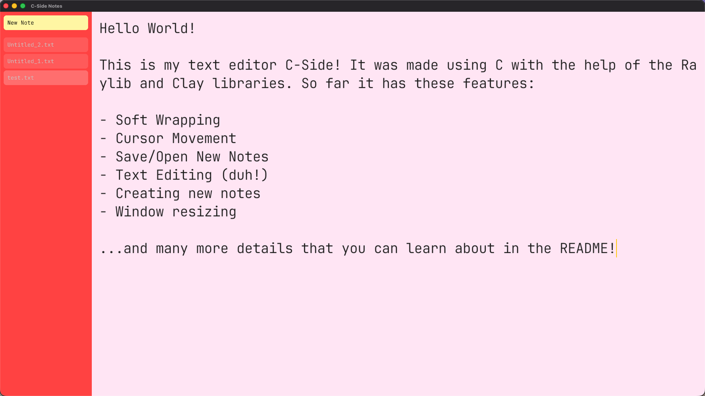

# C-Side

A lightweight, custom-built text editor engine written in C99.

C-Side Notes is a minimal text editor that implements a custom text buffer engine, 2D cursor navigation logic, and a hybrid rendering system using **Raylib** for the backend and **Clay** for the UI layout.



## Features

*   **Custom Text Engine:** Does not use native inputs. Text insertion, deletion, and wrapping are handled via manual memory manipulation.
*   **Smart 2D Navigation:** Cursor logic handles column memory ("snapping") when moving between lines of different lengths.
*   **Soft Wrapping:** Text automatically wraps based on the window size without modifying the underlying data buffer.
*   **File Persistence:** Automatically scans, creates, reads, and writes `.txt` files in a local directory.
*   **Modern UI:** Features a reactive sidebar and button system built with the Clay layout engine.

## Tech Stack

*   **Language:** C99 (Strict typing with `stdint.h`)
*   **Rendering & Input:** [Raylib](https://www.raylib.com/)
*   **UI Layout:** [Clay](https://github.com/nicbarker/clay)
*   **Build System:** Make (Unity Build Architecture)

## Architecture

This project avoids "Black Box" text inputs. Every pixel of the text and every byte of memory is managed manually.

### The Hybrid Rendering Pipeline
The application uses a two-pass rendering approach:
1.  **The UI Pass (Clay):** The sidebar and background containers are calculated using Clay's high-performance layout engine.
2.  **The Text Pass (Raylib):** The text editor area is rendered on top using a custom loop that calculates visual wrapping and cursor position in real-time.

### The "Fat Struct" Pattern
State management is handled via a single centralized structure (`TextBuffer`) that holds raw character data, metadata (cursor index, timers), and file system state.

```c
typedef struct {
  char text[BUFFER_SIZE];
  i32 cursorIndex;
  i32 letterCount;
  // ... timers and file handles
} TextBuffer;
```

### Memory Model
Text manipulation uses a linear buffer approach. Inserting or deleting characters involves shifting the memory array to accommodate data, ensuring full control over the buffer state at the cost of O(N) complexity for large files.

## Installation & Build

### Prerequisites
*   **C Compiler** (GCC or Clang)
*   **Raylib** (Installed via Homebrew on Mac, or linked locally)

### Building
The project uses a **Unity Build** system (all source files are included into `main.c`). This simplifies the compilation process to a single command.

```bash
# Clone the repository
git clone https://github.com/yourusername/C-Side.git
cd C-Side

# Compile and Run
make run
```

*Note: If you are on macOS, ensure you have the required frameworks (CoreVideo, IOKit, Cocoa, GLUT, OpenGL) linked, as defined in the Makefile.*

## Controls

| Key | Action |
| :--- | :--- |
| **Typing** | Insert text |
| **Arrow Keys** | Move cursor (Left/Right/Up/Down) |
| **Backspace** | Delete character (supports hold-to-delete) |
| **Cmd + S** | Save current file |
| **Cmd + D** | Toggle Debug Info overlay |
| **Mouse Click** | Select files in the sidebar |

## File Structure

*   `main.c`: Entry point, initialization, and main loop.
*   `buffer.h`: Type definitions, structs, and function prototypes.
*   `editor.c`: Core logic for text manipulation, wrapping, and drawing.
*   `ui_layout.c`: Clay layout definitions for the Sidebar and Containers.
*   `file_io.c`: Low-level interactions with `<stdio.h>` and `<dirent.h>`.

## License

This project is open source. Feel free to use it as a reference for building your own text engines in C.
